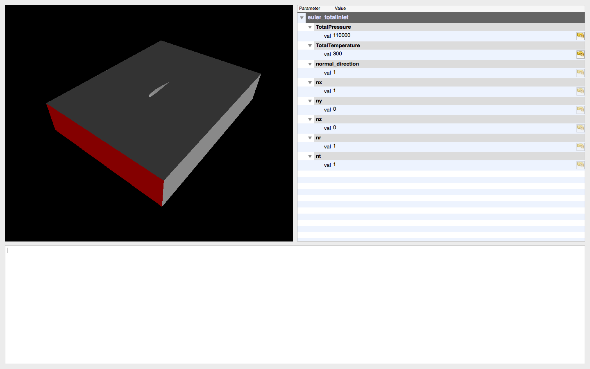

# PyChiDG


A Python Interface for ChiDG: A Chimera-based, discontinuous Galerkin solver


## Pythonic ChiDG Interface


```
import pychidg

sim = pychidg.Sim()

sim.read_grid('gridfile.h5')
sim.read_boundaryconditions('gridfile.h5')

sim.set('Nonlinear Solver','Quasi-Newton')
sim.set('Linear Solver','Quasi-Newton')

sim.run()
```


## Application for User Configuration

* Python application
* Runs on Qt, PyQt, and PyQtGraph




## License
PyChiDG is released under the BSD 3-clause license. See LICENSE file.


## Author Acknowledgement:
Nathan A. Wukie   <nwukie@gmail.com>


